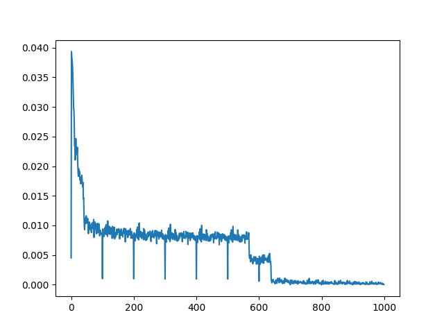

### 使用卷积神经网络和前馈神经网络来进行mnist数据的预测

#### 前馈神经网

比较navie，网络模型不讲解了。利用nn Module可以很容易的实现。

#### 卷积神经网络

这里特别说明的是卷积和池化两部分。

#### 数据处理部分

简单说下数据处理部分。关于mnist的数据详细说明在其官网已经给出了。需要注意的是他开始有几个字节的偏移。使用gzip打开以后是字节流的形式。关于python字节与int互转的说明可以戳[这里](https://www.delftstack.com/zh/howto/python/how-to-convert-bytes-to-integers/)，然后具体代码如下：

```python
		piexs = file_content[i*28*28:(i+1)*28*28]
		piexs = [piexs[index] for index in range(28*28)]
```

再将其转换为numpy的数组就可以用了。并且他的像素点是按行存储的，那么我们也简单的将其存储在list里就好。因为在初始化tensor时比较方便。同时也可以利用image模块画出图像来。

### 模型结果

前馈神经网训练loss过程结果如下：

然后准确率为：0.884还是比较不错的。

而卷积神经网络的结果如下：



准确率竟然达到了0.981.果然厉害。