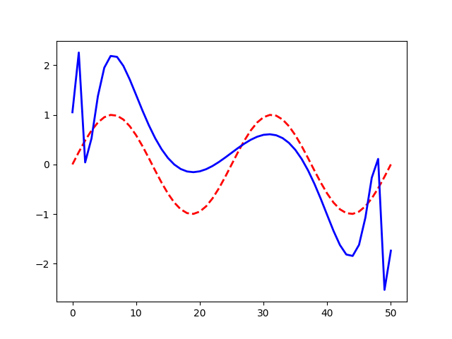
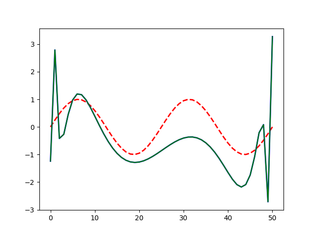
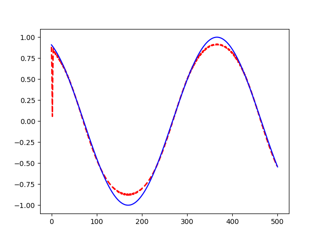

### 从函数拟合来学习神经网络

curve fitting说明：

利用多项式和前馈神经网来拟合正弦曲线。

其中多项式拟合实际上一个线性回归问题，因为升维以后，实际上拟合的就是一个超平面。

这也是广义最小二乘法。不过最小二乘法通常是找闭式解，且数据真的是在一个超平面上。

可以发现，两者的拟合效果都不是特别好。

代码说明，仅仅使用pytorch的autograd机制，便于真正理解网络结构。

其中前馈神经网的拟合如下：



多项式拟合如下（项数为100）：



需要注意的是多项式的拟合是有封闭解的，不过我们仍然采用梯度下降的方法来拟合。

而且本例中，我们采用的批量梯度下降的方法。

然后使用rnn来拟合，果然可以说非常强大了，先上效果：



恩，虽然说不出为什么，但还是感觉真心厉害的有没有。这可能就是rnn为什么特别适合时间序列的主要原因吧。

通过以上几个例子，可以说让我彻底明白了随机梯度下降，批量梯度下降，以及fnn与rnn。之前对于线性拟合问题，总是固执的认为，不是有闭式解么，为什么使用梯度下降来求啊。其实，梯度下降提供的是一种通用的方法。就是说，不管待求函数有没有闭式解，只要可微，我们总能找到他的最小（极小值）。

比如给定函数$$f$$：
$$
f = 1/2(x_1^2+x_2^2)
$$
实际上他也是有闭式解的，但是我们仍能使用梯度下降求其最小值。因为现实中，我们待优化的函数非常复杂，并不能解出显式解，所以通过这种方式来求其最小值。

### 梯度下降

如果是给定的函数如$$f$$这种形式，那么相信对于梯度下降的理解肯定没有问题，因为根据微分方程我们有：
$$
f^{(new)} = f^{(old)} + (x^{(new)}-x^{(old)})*{ \nabla f}|_{x=x^(old)}
$$
通过分析我们得到，沿着梯度方向走是变化最快的。但是每次变化多大，我们是不清楚的，所以我们智能通过尝试的方法。也即是：
$$
x^{(new)} = x^{(old)} + \nabla f|_{x=x^{(old)}}*\gamma
$$
其中$$\gamma$$称之为学习率，需要我们通过尝试获得。

如果到这里，并且函数就是如上数形式，那么相信大家很快就可以写出梯度下降的伪代码：

如下形式：

```python
init x_old
for i in iters:
	x_new = x_old + lr * \nabla f|x=x_old
```

可以说非常简单，也非常容易理解。

但是，当我们回到代价函数时，却不是那么容易理解了。首先我们来先看一下容易理解的batch 梯度下降。

不管三种方法如何，始终记住我们的目标是最小化整个数据集上的风险，也就是：
$$
min\epsilon= \sum_{(x_i,y_i)\in \Bbb D} E(x_i,y_i;\theta)
$$
其中，当我们把整个数据集都代入进去时，那么实际上我们的$$\epsilon$$就仅仅是一$$\theta$$的一个函数，那么我们就可以转化为标准形式了。但是，人们发现，这种方法实际上并不好，与其在整个数据集上更新一次参数，还不如我们随机选取一批（固定大小）数据来更新参数，这样参数更新的比较频繁，计算代价也比较小。通常效果更好。极端的情况，我们每次使用单个数据来计算cost ，然后跟新一次参数。以上分别就是批量梯度下降，小批量梯度下降，随机梯度下降。